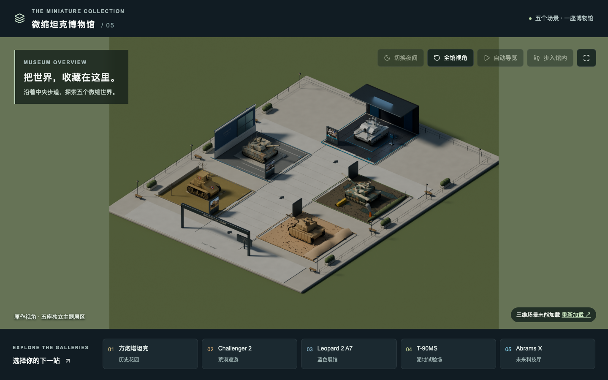

# 微缩坦克博物馆

基于 React、Three.js 和 Vinext 的交互式 3D 博物馆，包含五个主题展区、总览与展区视角、步行与自动导览、昼夜切换、动态游客和按需加载的高清贴图。

## 在线预览

- 网站：[https://procedural-tank-web-git-tank-museum-live-daveleexs-projects.vercel.app](https://procedural-tank-web-git-tank-museum-live-daveleexs-projects.vercel.app)
- 源码：[https://github.com/DaveleeX/tank-museum](https://github.com/DaveleeX/tank-museum)



## 本地运行

需要 Node.js 22.13 或更新版本，以及 npm。推荐使用 Node.js 24。

```bash
npm ci
npm run dev
```

打开终端输出的本地地址。运行时无需 Blender、外部模型目录、API 密钥或原 Sites 项目。

## 检查与构建

```bash
npm run typecheck
npm test
npm run build
```

`npm run build` 默认产出 Cloudflare Worker 构建。在 Vercel 上会检测 `VERCEL` 环境变量，改用 Nitro 生成 `.vercel/output`。三维模型与贴图随站点一起发布到 Vercel，浏览器从同一域名加载 `/museum/` 资源。

## 目录

```text
app/                    页面、布局和样式
components/ui/button.tsx 页面实际使用的按钮
lib/                    三维引擎、灯光、材质、游客与工具函数
public/museum/          预览图、相机与最终模型资源
scripts/                资源、昼夜、材质与游客验证
```

`public/museum/model-hybrid/` 中的 glTF、分片 BIN、WebP 和 `lighting.json` 必须一起保留。普通与高清贴图分别用于总览和进入展区后的加载；日间和夜间贴图用于光照混合，并非重复文件。

## 精简范围

此目录仅保留可独立安装、运行、构建和验证的网页工程。已排除 Blender 工程及备份、建模与烘焙脚本、历史导出、压缩包、渲染对比图、验证报告、安装依赖、构建产物、缓存、旧 Git 历史、原 Sites 项目绑定，以及未使用的模板组件与依赖。

最终网页所需的导出资源已经包含在仓库中。此版本不包含重新建模或重新烘焙的制作工程。

仓库未指定开源许可证；如需授权他人复用，请自行选择并添加适用的 LICENSE。
